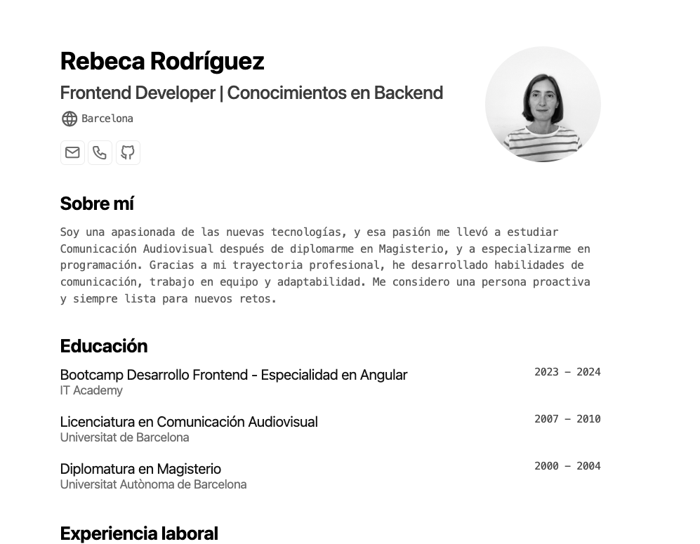

# 📄 Mi CV/Portafolio

Este proyecto es un CV/Portafolio personal desarrollado utilizando [Astro](https://astro.build/), diseñado para mostrar mi experiencia profesional y proyectos personales.

Si quieres, puedes ver el resultado [aquí](https://cvrebecarodriguez.netlify.app/). 

## 🌟 Inspiración

El diseño y estructura de este CV/Portafolio se inspira en los siguientes esquemas y proyectos:

- **[JSON Resume Schema](https://jsonresume.org/schema)**
- **[cv by Bartosz Jarocki](https://github.com/BartoszJarocki/cv)**
- **[minimalist-portfolio-json by midudev](https://github.com/midudev/minimalist-portfolio-json)**

## 🛠 Tecnologías Utilizadas

- **[Astro](https://astro.build/)**
- **[Ninja Keys](https://github.com/ssleptsov/ninja-keys?tab=readme-ov-file)**

## 🚀 Empezando

Para utilizar este proyecto y personalizar tu propio CV/Portafolio, sigue estos pasos:

1. **Clonar el repositorio**:
   ```bash
   git clone URL_DEL_REPOSITORIO
   cd nombre_del_repositorio

2. **Instalar dependencias**
   ```bash
   npm install

3. **Iniciar el proyecto**
   ```bash
   npm run start

## 🔧 Uso

1. Actualiza el archivo resume.json con tu información personal siguiendo el esquema JSON de CV.

2. Personaliza el diseño según tus preferencias.

3. Despliega el proyecto en tu plataforma de alojamiento web.

## 🤝 Contribuciones
Las contribuciones son bienvenidas. Si tienes alguna idea o mejora, no dudes en hacer un fork del repositorio y abrir un pull request.

## 📷 Ejemplo



